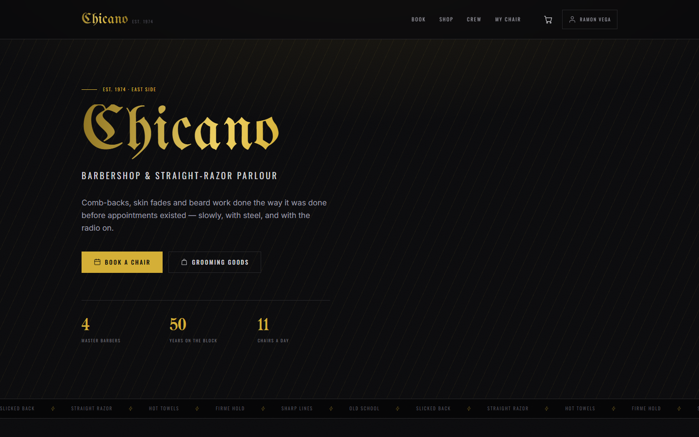
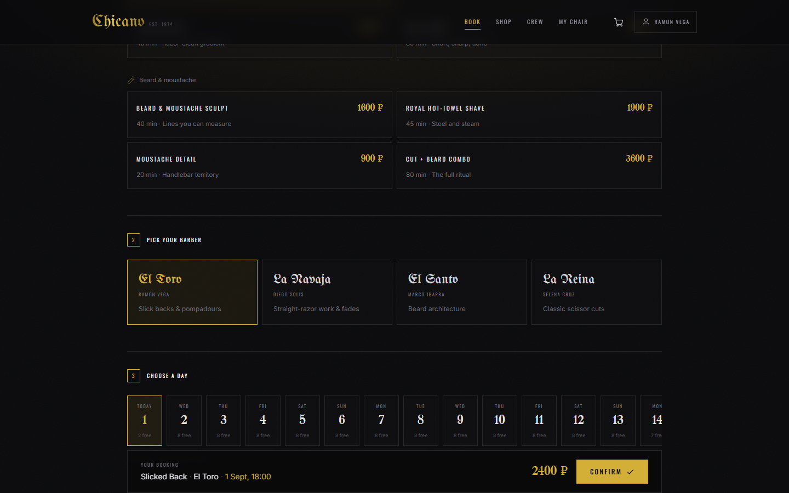
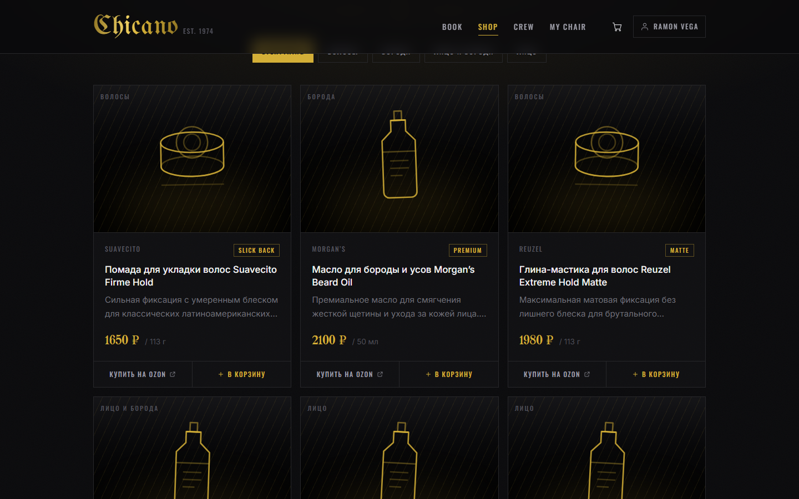
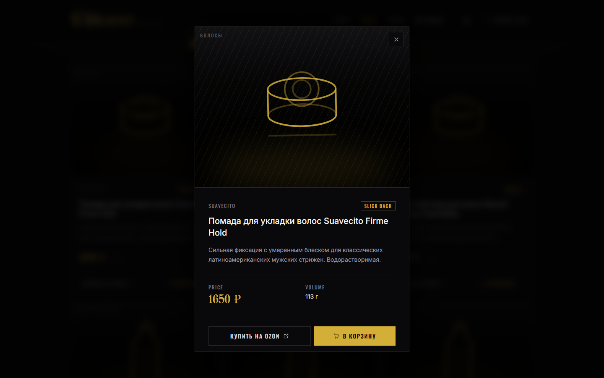
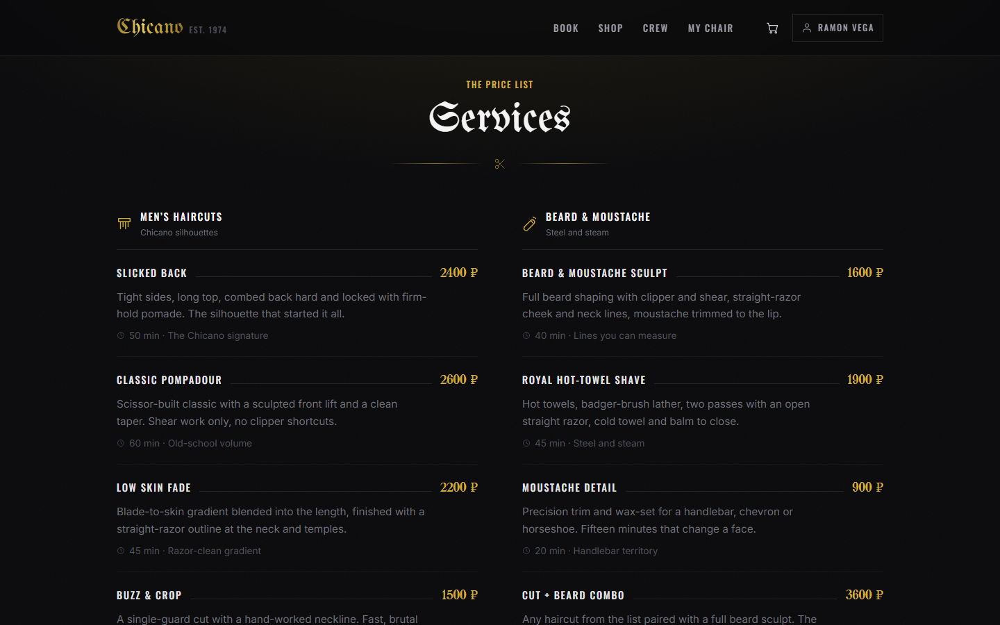
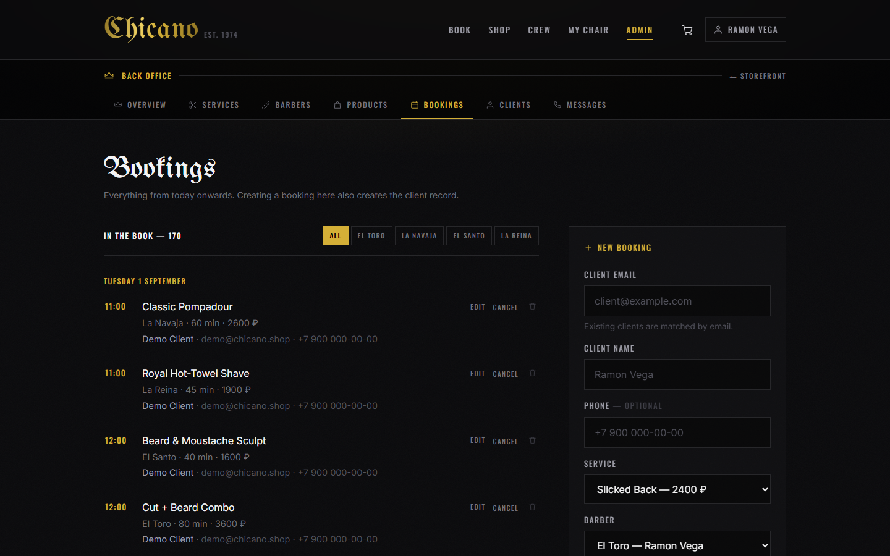
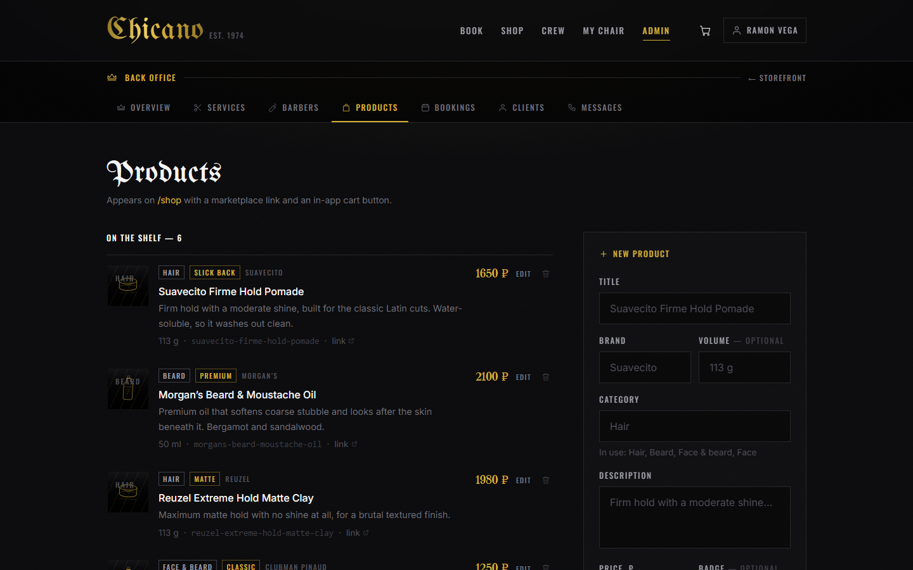
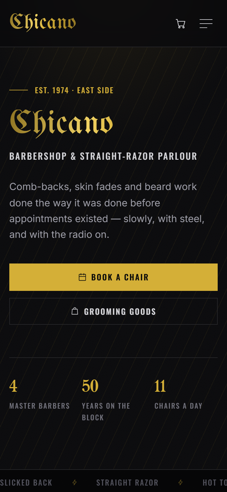
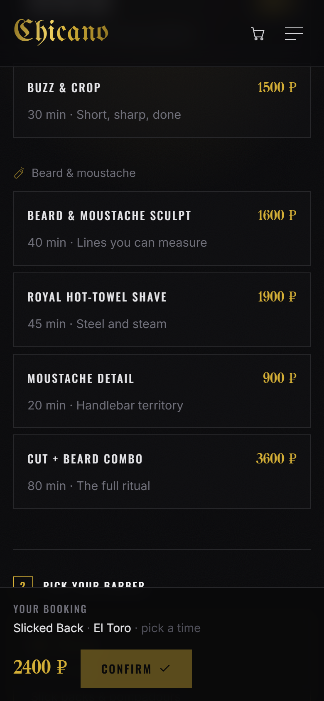
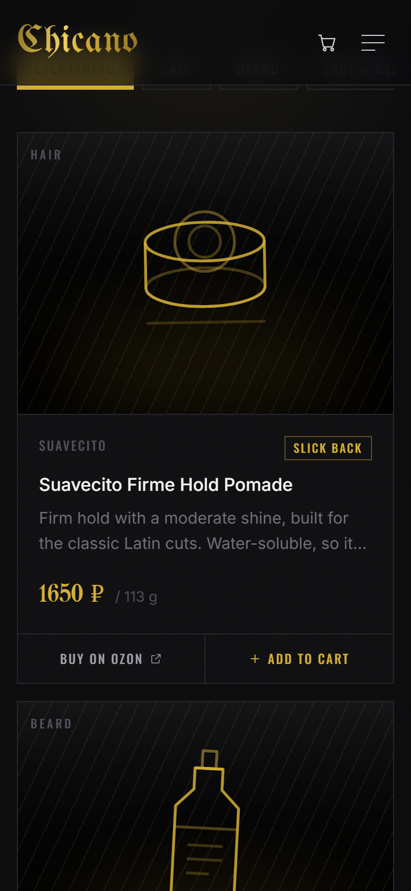

# Chicano Barbershop — prototype

Booking and shop prototype for a barbershop, built with **SvelteKit 2 / Svelte 5 (runes)**,
**Tailwind CSS v4** and **SQLite** (`better-sqlite3`).

## Demo

There is no hosted demo yet — the fastest way to see it is to run it locally, which takes
about a minute:

```bash
git clone https://github.com/Dictordozel/chicano.git
cd chicano && npm install && npm run dev     # http://localhost:5173
```

The database seeds itself on first boot: 8 services, 4 barbers, 6 products and two weeks of
partly-booked slots. Sign in with any email — there are no passwords. For the back office go
to `/admin` and enter the passcode (`chicano` by default).

## Screenshots



| Booking — service, barber, day rail, slot grid | Shop — catalogue with category filters |
| --- | --- |
| [](docs/screenshots/booking.png) | [](docs/screenshots/shop.png) |
| **Product card** — marketplace link and in-app cart | **Price list** on the landing page |
| [](docs/screenshots/shop-product.png) | [](docs/screenshots/services.png) |

**Back office** — the day book, and the catalogue editor beside it

| Bookings | Products |
| --- | --- |
| [](docs/screenshots/admin.png) | [](docs/screenshots/admin-products.png) |

**Mobile-first** — clients book from a phone, so that is where the layout starts

| Landing | Booking | Shop |
| --- | --- | --- |
|  |  |  |

## Run

```bash
npm install
npm run dev        # http://localhost:5173
```

The database is created and seeded automatically on first boot at `data/chicano.db`.

```bash
npm run db:reset   # wipe and re-seed the demo data
npm run build      # production build
npm run preview    # serve the production build
```

## Run it on a server

Built with `@sveltejs/adapter-node`, so it is a plain Node server — no platform required.

```bash
git clone https://github.com/<owner>/<repo>.git
cd <repo>
npm ci
npm run build
PORT=3000 npm start          # http://<server>:3000
```

`better-sqlite3` is a native module: `npm ci` compiles or downloads a prebuilt binary for the
target machine, so run it *on the server*, not by copying `node_modules` across.

Environment variables (all optional):

| Variable | Default | Purpose |
|----------|---------|---------|
| `PORT` | `3000` | Port the Node server listens on |
| `HOST` | `0.0.0.0` | Interface to bind |
| `ORIGIN` | — | Public URL, e.g. `https://chicano.example.com`. Set this behind a proxy, otherwise form POSTs are rejected as cross-site |
| `ADMIN_PASSCODE` | `chicano` | Unlocks `/admin` for a signed-in user |

The database is a single file at `data/chicano.db`, created and seeded on first boot. It is not
in git — back it up, or delete it to start fresh. Keep the process alive with systemd, pm2 or
Docker as you prefer.

**Before showing it to anyone outside the shop:** sign-in is simulated and there is no payment
step. Set `ADMIN_PASSCODE` to something of your own, and do not put real client data in it.

## Routes

| Route      | What it does |
|------------|--------------|
| `/`        | Landing page — hero, price list, crew, shop teaser |
| `/booking` | Service → barber → date → time → details, with a confirmation panel. A rail covers the next fortnight for impulse bookings; a date field reaches the rest of the 60-day window |
| `/shop`    | Product catalogue with category filters, detail modal, cart and Ozon links |
| `/cart`    | Quantity steppers, removal, simulated checkout |
| `/crew`    | Barber profiles with today's free-slot count |
| `/login`   | Simulated sign-in (email + name, no password) |
| `/account` | Upcoming bookings, history, shop orders, cancellation |
| `/logout`  | POST-only action that destroys the session |

### Back office

| Route | What it does |
|-------|--------------|
| `/admin` | Counts, today's chairs, what is coming up |
| `/admin/services` | List, add, edit and delete haircuts / beard work |
| `/admin/barbers` | List, add, edit and delete barbers — a new one opens 11 daily slots at once |
| `/admin/products` | List, add, edit and delete shop goods, Cyrillic titles included |
| `/admin/appointments` | Day book for every barber; create, edit, cancel, restore and delete bookings |
| `/admin/clients` | Search, add, edit and delete clients; grant or revoke back-office rights |
| `/admin/messages` | SMS outbox, and the force-majeure broadcast |
| `/admin/unlock` | Passcode gate that grants back-office rights |

Access is `signed in` + `users.is_admin`. A signed-in visitor unlocks the flag once by
entering the passcode — `chicano` by default, or `ADMIN_PASSCODE` from `.env`
(see `.env.example`). Every admin page guards its own load, so a locked visitor never
receives back-office data.

Adding a service, barber or product shows up on the public pages immediately.
A service or barber that already has bookings refuses deletion, so history stays readable.

**Editing** — services, barbers, products, bookings and clients — uses `?edit=<id>` on the same page:
the create form switches to edit mode, which keeps the link shareable and working without JS.
Saving redirects back to a clean list. Renaming a barber leaves their bookings attached.

Editing a booking can move it to another service, barber, day, time or client. The slot check
ignores the booking itself, so saving without moving it never reports a clash.

A client's email is their identity — sign-in matches on it — so changing it changes how they
sign in, and an email already held by someone else is refused rather than merged. A client
with bookings or orders cannot be deleted, since bookings would cascade away with them.

**Back-office rights** can be granted or revoked per client from that list; an admin cannot
change their own, which would bounce them to the passcode gate mid-session. Because sign-in
is simulated, granting rights to an address means anyone who types that address is an admin —
the page says so. The `/admin/unlock` passcode always remains as a way back in.

Prices are handled so an edit never rewrites the past: a booking freezes the service price
into `appointments.price` when it is made, and an order freezes its line items as JSON.
Moving a booking keeps that quote; swapping it to a *different* service re-quotes at the new
service's current price. A live cart, by contrast, always reflects the current product price.

## SMS

Two reminders per booking — 24 h and 1 h before — plus a broadcast for the day the power
goes out and everyone has to be moved.

Everything queues into one `notifications` table that a worker drains once a minute, so a
message is never sent twice and never lost while the server is down. Reminders are queued
when a booking is made and follow it: move the slot and they move with it, cancel and they
are withdrawn, restore and they come back. A reminder more than 6 h overdue is dropped rather
than delivered late — nobody wants yesterday's reminder at breakfast.

A client with no phone number is recorded as `skipped` with the reason, not silently ignored:
the broadcast screen lists exactly who needs a phone call instead.

**The broadcast** (`/admin/messages`) picks an audience — today, one day, a range, everything
upcoming, or *everyone registered* — optionally narrowed to one barber, and shows how many of
them are reachable before anything is sent. The last scope ignores the day book entirely and
reaches every client on file, booking or not: the one for a New Year greeting. It is keyed on
the client, so somebody with three bookings still gets one message, and because there is no
booking behind it only `{name}` resolves — a template still carrying `{date}` or `{time}` is
refused rather than sent with literal braces in it. The message is typed into the form and supports
`{name} {date} {time} {service} {barber}`; a character counter shows how many SMS it will
cost (Cyrillic is 70 characters per part, not 160). Sending requires typing the recipient
count by hand. Reminder wording lives in `src/lib/server/notifications.js`.

### Going live

Out of the box the provider is **simulated**: messages are queued and recorded in the outbox,
and nothing leaves the building. That is enough to exercise the whole schedule. For real
delivery, set the environment variables below — an account with the gateway is on you.

| Variable | Purpose |
|----------|---------|
| `SMS_PROVIDER` | `smsru` to send for real; anything else keeps the simulator |
| `SMS_API_KEY` | Gateway API key |
| `SMS_FROM` | Optional sender name |

Another gateway means one more branch in `deliver` inside `src/lib/server/sms.js`; nothing
else in the app knows which one is in use.

```bash
node scripts/test-notifications.mjs   # 18 checks against a running dev server
```

## Data model

`users` · `sessions` · `services` · `barbers` · `appointments` · `products` · `cart_items` · `orders` · `notifications`

- A `UNIQUE (barber_id, date, time)` index on `appointments` is what actually prevents
  double booking — the UI check is only the fast path.
- The cart is keyed by an anonymous `chicano_cart` cookie, so guests can fill one before
  signing in. Checkout is the only gate that requires an account.

## Prototype boundaries

Deliberately not production-grade: no passwords, no payment, no email delivery.
Sign-in creates a session row and an httpOnly cookie; checkout writes an `orders` row
and empties the cart.

See [AGREEMENTS.md](./AGREEMENTS.md) for the working agreements on this project.
